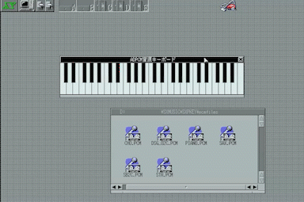

# SXPKEY.R
X680x0のSX-WINDOWで動作するADPCMを音源としたキーボードです。  
1音のADPCMファイルから各音階に対応したADPCMを動的に生成します。  
X680x0の拡張音源インターフェースである[ras68k-ext](http://opmregisters.web.fc2.com/ras68k/)にも対応しており、PCM8が無くても複数音を同時に弾くことが可能です。




## 使用方法
SXPKEY.Rを起動して、Cの音の15.6KHzのADPCMファイルをドラッグ&ドロップしてください。  
各音階のADPCMを生成するため、少し時間が掛かりますが、処理完了後は鍵盤へのクリック、  
及びX68Kキーボードで弾くことができます。PCM8を常駐させておくと、複数音を同時に弾くことが可能です。  
pcmfilesディレクトリにサンプルのADPCMファイルが同梱されています。  

また、ras68k-extを使用する場合は、右クリックし、メニューで「ras68k-extを使用」を選択してください。  
事前にpilibを常駐させておく必要があります。  
※SX-WINDOWのコンソールからpilibを常駐させても認識が出来ないため、SX-WINDOW起動前に常駐させてください。

キー配置は以下となります。
| &nbsp;&nbsp;&nbsp;&nbsp;キー&nbsp;&nbsp;&nbsp;&nbsp; | 音階 |
| ---- | ---- |
|  Q  |  G#(ソ#)  |
|  A  |  A(ラ)  |
|  W  |  A#(ラ#)  |
|  S  |  B(シ)  |
|  D  |  C(ド)  |
|  R  |  C#(ド#)  |
|  F  |  D(レ)  |
|  T  |  D#(レ#)  |
|  G  |  E(ミ)  |
|  H  |  F(ファ)  |
|  U  |  F#(ファ#)  |
|  J  |  G(ソ)  |
|  I  |  G#(ソ#)  |
|  K  |  A(ラ)  |
|  O  |  A#(ラ#)  |
|  L  |  B(シ)  |
|  ;  |  C(ド)  |
|  @  |  C#(ド#)  |
|  :  |  D(レ)  |
|  \[  |  D#(レ#)  |
|  \]  |  E(ミ)  |
|  ←  |  オクターブ下げ  |
|  →  |  オクターブ上げ  |

起動オプションで以下が指定可能です。
| &nbsp;&nbsp;&nbsp;&nbsp;switch&nbsp;&nbsp;&nbsp;&nbsp; | 説明 |
| ---- | ---- |
|  -I   |  アイコン化した状態で起動します。  |
|  -K   |  押下した鍵盤を非表示にします。  |
|  -P\[num\]  |   読み込むADPCMファイルサイズの上限を指定します。デフォルトは7,800byteです。  |
|  -R  |   ras68k-ext使用モードで起動します。  |

## ビルド方法
ビルドはyosshinさんの[xdev68k](https://github.com/yosshin4004/xdev68k)を使用させていただいています。  
また、本プログラムはリロケータブル形式(*.R)に変換するためにCV.Xと、プログラムサイズの埋め込みのためsrcディレクトリにあるRSIZE.Rをxdev68k/x68k_binにコピーしておく必要があります。

xdev68kの環境構築後に、bashコンソールで以下を実行してください。
```
cd src
make
```

X680x0上では、以下でビルドが可能です。
```
cd src
make -f makefile.x68k
```

## 謝辞
- pcmfilesディレクトリのADPCMファイルはZ-MUSICシステムver3.0のムックに収録されている、[Z-MUSICダウンロードページ](http://www.z-z-z.jp/zmusic/library/ZM3DLPG.htm)からもダウンロード可能なADPCMファイルをサンプルとして同梱させていただきました。

## ライセンス
SXPKEYはMITライセンスを適用しています。
